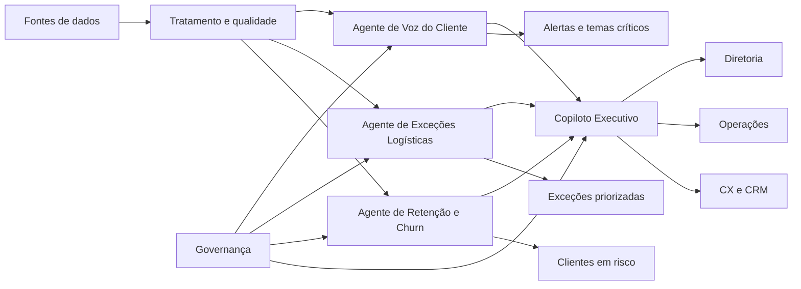

# Arquitetura Conceitual Inicial

## Objetivo

Definir uma arquitetura inicial, de nível executivo, para organizar fontes de dados, agentes, fluxos de entrada e saída e mecanismos de governança.

## Componentes Principais

### 1. Fontes de Dados

**Disponíveis no recorte Olist**

- cadastro e perfil de clientes;
- pedidos e transações;
- datas de ciclo logístico e entrega estimada;
- reviews.

**Necessárias para operação futura**

- tracking, transportadoras e devoluções;
- tickets, contatos de atendimento, NPS e pesquisas;
- campanhas, CRM, metas e indicadores operacionais atualizados.

### 2. Camada de Tratamento e Qualidade

- padronização de campos;
- deduplicação;
- consolidação por pedido (`order_id`) e cliente longitudinal (`customer_unique_id`);
- checagem de completude;
- controle de atualização.

### 3. Camada de Inteligência com Agentes

- Analista de Voz do Cliente;
- Orquestrador de Exceções Logísticas;
- Guardião de Retenção e Churn;
- Copiloto Executivo de Eficiência.

### 4. Camada de Consumo

- dashboards executivos;
- alertas operacionais;
- filas de priorização;
- recomendações para times;
- resumos periódicos para liderança.

### 5. Camada de Governança

- trilha de auditoria;
- revisão humana;
- política de acesso;
- monitoramento de qualidade;
- medição de resultado.

## Fluxo Conceitual

## Entradas e Saídas por Tipo

### Entradas estruturadas

- pedidos;
- datas de entrega estimada e realizada;
- métricas de compra;
- segmentação de clientes;
- histórico de compra e nota de review.

### Entradas não estruturadas

- reviews;
- comentários;
- feedback textual.

### Saídas operacionais

- alertas priorizados;
- classificação de criticidade;
- recomendações de ação;
- filas para tratamento humano.

### Saídas executivas

- resumo de impacto;
- principais causas-raiz;
- tendências;
- riscos;
- oportunidades de melhoria.

As recomendações devem informar se resultam de dado histórico disponível ou de fonte operacional ainda não integrada.

## Interações entre Agentes

- o agente de voz do cliente sinaliza temas e causas recorrentes;
- o agente logístico correlaciona atrasos e falhas com impacto operacional;
- o agente de retenção cruza experiência, comportamento e risco;
- o copiloto executivo sintetiza conflitos, prioridades e impacto esperado.

## Princípios de Governança

1. nenhuma ação crítica deve ocorrer sem supervisão humana;
2. toda recomendação relevante deve ser explicável;
3. o uso de dados deve respeitar privacidade e acesso mínimo;
4. métricas de qualidade precisam ser acompanhadas desde o piloto;
5. cada agente precisa ter dono funcional e critério de sucesso.

## Arquitetura de Evolução

### Fase 1

- desenho conceitual;
- alinhamento com áreas;
- priorização de casos de uso;
- definição de indicadores.

### Fase 2

- piloto com dados reais;
- validação de precisão e adoção;
- integração a fluxos operacionais.

### Fase 3

- escala para múltiplos domínios;
- automações assistidas;
- governança contínua.
